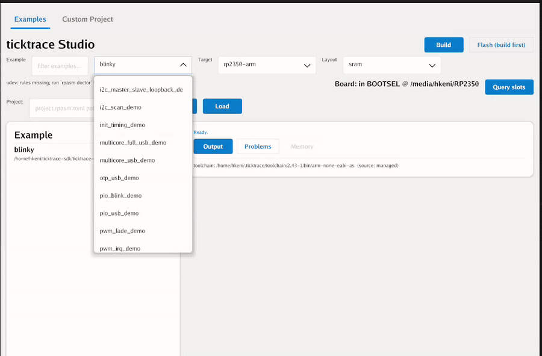
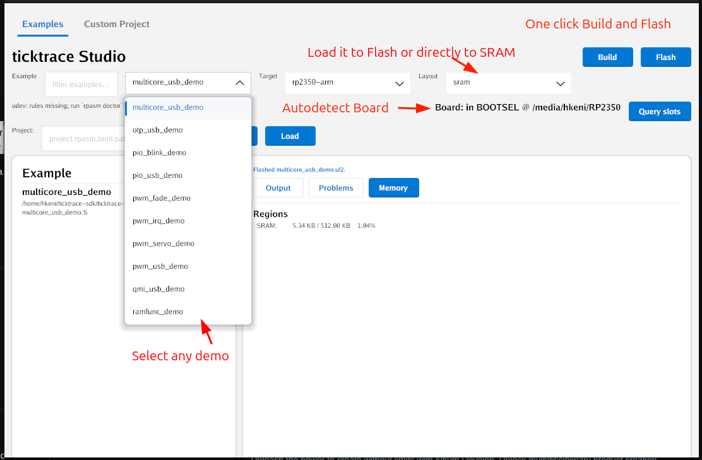

# ticktrace

Pure-assembly firmware SDK for the Raspberry Pi RP2350 (Cortex-M33).
**Every cycle matters.**

- **No C compiler.** Firmware is assembled with `arm-none-eabi-as` and linked with `arm-none-eabi-ld`. The result is a UF2 you drag onto the Pico 2.
- **1.2 KB blinky.** Default driver set, full clock-tree bring-up, UART banner, dual-core ready. The `.text` section is 1192 bytes.
- **5.6 MB toolchain.** A minimal binutils-only build. No `gcc`, no `newlib`, no `libstdc++`. The SDK has nothing to feed them.
- **Verified on silicon.** 283 Unicorn-emulator tests + QEMU ISA tests + Renode platform tests, plus hardware bring-up on a Pico 2.
- **Dual-licensed.** [AGPL-3.0-or-later](LICENSE) for open-source, personal, educational, and evaluation use. A [commercial license](COMMERCIAL-LICENSE.md) is available from Amken LLC for proprietary firmware that can't comply with the AGPL. Contact [licensing@ticktrace.io](mailto:licensing@ticktrace.io).

Build a UF2 with one line on Mac, Windows, or Linux:

```sh
docker run --rm -v "$PWD":/workspace ghcr.io/ticktrace-sdk/sdk:slim
```

For a GUI, download [ticktrace Studio](https://github.com/ticktrace-sdk/ticktrace-studio/releases). It bundles the toolchain and flashes the Pico for you in one click.



[www.ticktrace.io](https://www.ticktrace.io) · [Studio](https://github.com/ticktrace-sdk/ticktrace-studio) · [Docs](docs/)

## What blinky looks like

The entire `main` function of the default firmware: clock-tree bring-up, UART banner, blinking LED. Every cycle accounted for, every line a deliberate operation. This is the actual source ([src/main.S](src/main.S)):

```asm
    .thumb_func
    .global main
main:
    @ ---- Clock tree bring-up ---------------------------------------------
    bl      xosc_init                       @ XOSC stable
    bl      pll_sys_150_mhz                 @ pll_sys = 150 MHz
    bl      pll_usb_48_mhz                  @ pll_usb = 48 MHz
    bl      clocks_init                     @ wire muxes
    bl      tick_init                       @ 1 MHz tick to TIMER0/1/WDG
    bl      watchdog_disable                @ explicit safe state

    @ ---- Peripheral init at the new clock rate ---------------------------
    bl      gpio_led_init                   @ LED on GP25
    bl      uart0_init                      @ wrong baud (computed for 12 MHz)
    bl      clocks_post_pll_uart_baud_fixup @ fix to 150 MHz divisors

    ldr     r0, =banner
    bl      uart0_puts

.Lloop:
    bl      gpio_led_toggle

    @ 3-cycle inner body (subs + bne) at 150 MHz = 20 ns / iteration.
    @ DELAY_COUNT = 12_500_000 -> 250 ms half-period -> ~2 Hz blink.
    ldr     r0, =DELAY_COUNT_150MHZ
1:  subs    r0, #1
    bne     1b

    b       .Lloop
```

## What's included

**Peripheral drivers.** Each is a plain Thumb-2 AAPCS function you call directly from your assembly:

| Peripheral | What you get |
|------------|-------------|
| GPIO / PADS | 48-pin control, IRQ, pad isolation |
| UART | Full PL011, 115200 8N1 out of the box |
| I2C | DesignWare I2C0/1, master + slave |
| SPI | PL022, full duplex, DMA chained |
| USB | Device CDC-ACM, plug in and get a serial port |
| DMA | 16-channel, mem-to-mem and peripheral |
| PWM | 12-slice, freq/duty helpers, servo cookbook |
| Timers | TIMER0/1, SysTick, NVIC plumbing |
| PIO | Hand-encoded programs, SM control |
| ADC | 8-channel + on-chip temperature sensor |
| SHA-256 | Hardware accelerated |
| TRNG | Hardware random number generator |
| Multicore | Dual-core launch, SIO FIFO, hardware spinlocks, interpolators |
| Flash / XIP | QMI tuning, OTP reads, BOOTSEL trick |
| Scheduler | NVIC-priority cooperative scheduler + lock-free ISR→task queue |
| Trace | DWT cycle counter, ITM/TPIU/ETM for on-hardware profiling |
| C bridge | Write your app in C; drivers stay assembly |
| Rust bridge | `no_std` Rust apps via `rp-asm-sys` crate |

**51 examples** in `examples/` provide a clear usage pattern for each peripheral and subsystem. Each builds to its own UF2.

**Tests:** 283 T1 (Unicorn emulator) + QEMU ISA smoke tests + Renode platform tests, all green. Every public driver function has at least one register-trace assertion.

## Quickstart

### With Docker (Mac, Windows, Linux: no install)

```sh
docker run --rm -v "$PWD":/workspace ghcr.io/ticktrace-sdk/sdk:slim
```

That builds `blinky.uf2` and every example into `./build/`. Same command, same result on every platform. No toolchain to install.

To run the test suite (T1 Unicorn + T2 QEMU + Go tool tests):

```sh
docker run --rm -v "$PWD":/workspace ghcr.io/ticktrace-sdk/sdk:full make test
```

Linux users whose UID isn't 1000 should add `--user $(id -u):$(id -g)` so build artefacts aren't root-owned.

### Native (Linux)

```sh
sudo apt install binutils-arm-none-eabi python3 python3-venv
make pydeps   # one-time: create .venv and install test dependencies
make          # builds blinky.uf2 + all examples
make test     # run emulator tests
```

### GUI (any platform)

[ticktrace Studio](https://github.com/ticktrace-sdk/ticktrace-studio/releases) is a one-download GUI that handles the toolchain, builds, and flashes the Pico for you. Pick a recipe from the catalog, click **Build & Flash**, done.



Studio first-launches and asks if you want a managed toolchain. If you say yes, it downloads a [5.6 MB minimal binutils build](https://github.com/ticktrace-sdk/binutils-arm-none-eabi) into `~/.ticktrace/toolchain/`. No compiler, no `newlib`, just the binutils the SDK actually uses.

## Flash

Hold **BOOTSEL** on your Pico 2 while plugging in USB. The board mounts as a USB drive. Drag any `.uf2` onto it.

Two image variants are available for every example:

| File | Where it runs | Survives power loss? |
|------|---------------|----------------------|
| `build/<name>.uf2` | SRAM at `0x20000000` | No, fast iteration |
| `build/<name>_flash.uf2` | Flash at `0x10000000` | Yes, shipped firmware |

```sh
make build/blinky_flash.uf2          # build a specific flash image
make build/<example>_flash.uf2       # any example
```

After flashing, open a serial terminal at **115200 8N1** on UART0 TX (GP0, pin 1).

## Repository layout

```
include/<periph>.inc       register maps and bitfields, one file per peripheral
src/<periph>.S             driver implementations
examples/<periph>_demo.S   self-contained examples
link/sram.ld               SRAM linker script
link/flash.ld              flash linker script
tools/uf2.py               bin → UF2 packer
tests/                     T1 (Unicorn), T2 (QEMU), T3 (Renode) test suites
docs/                      per-peripheral guides
Makefile                   build + test umbrella
```

## Documentation

Start with `docs/apps.md`. It walks through writing your first app from scratch. Then `docs/calling.md` for the AAPCS calling conventions everything else follows.

| Doc | Covers |
|-----|--------|
| `docs/apps.md` | First app: function anatomy, multi-file projects, IRQ handlers, Makefile wiring |
| `docs/boot.md` | Bootrom → `_reset` → `main`, SRAM vs flash, debugging a bring-up hang |
| `docs/calling.md` | AAPCS conventions, stack discipline, IRQ handler ABI, cycle costs |
| `docs/clocks.md` | XOSC/PLL bring-up, clock tree, baud recomputation |
| `docs/gpio.md` | 48-pin GPIO + PADS, IRQ, ISO/OD erratum |
| `docs/timer.md` | TIMER0/1, SysTick, NVIC plumbing |
| `docs/nvic.md` | NVIC: enable, install, pending, priority |
| `docs/dma.md` | 16-channel DMA, sniffer, IRQ aggregators |
| `docs/pwm.md` | 12-slice PWM, freq/duty math, servo cookbook |
| `docs/uart.md` | PL011, IRQ + DMA modes |
| `docs/i2c.md` | DesignWare I2C, master + slave, HCNT/LCNT math |
| `docs/spi.md` | PL022, full duplex, DMA chained |
| `docs/usb.md` | Device controller bring-up, CDC-ACM walkthrough |
| `docs/sha256.md` | Hardware SHA-256 + padding |
| `docs/adc.md` | 8-channel ADC + temp sensor + DMA capture |
| `docs/trng.md` | TRNG bring-up |
| `docs/pio.md` | PIO controller API + hand-encoding instructions |
| `docs/trace.md` | CoreSight DWT + ITM + TPIU + ETM for hardware profiling |
| `docs/sched.md` | NVIC-priority scheduler: task_post, BASEPRI critical sections |
| `docs/spsc.md` | Lock-free ISR → task byte queue |
| `docs/c_bridge.md` | C apps with assembly drivers |
| `docs/rust_bridge.md` | `no_std` Rust apps with assembly drivers |

## Design notes

- **Atomic aliases.** Every peripheral write uses the `+0x2000` SET / `+0x3000` CLR / `+0x1000` XOR aliases: one `STR`, two cycles, no scratch register, no ISR race.
- **Pad isolation.** RP2350 pads reset with `ISO=1`. Every driver that touches a pin clears `ISO|OD` via the PADS_BANK0 CLR alias.
- **AAPCS throughout.** All drivers are plain Thumb-2 functions that compose freely. Drivers can be called from C or Rust without a wrapper layer.
- **Image size.** `build/blinky.uf2` is ~1.2 KB of `.text` with the full default driver set. Each example UF2 is under 4 KB because it links only the drivers it needs.

## License

ticktrace is dual-licensed.

- **[AGPL-3.0-or-later](LICENSE)** for open-source, personal, educational, and evaluation use. If you're hacking on a hobby project or building something you'll open-source under a compatible license, you're set.
- **Commercial license** from Amken LLC for closed-source products that ship `arm-none-eabi-as`-assembled firmware built with these drivers. See [COMMERCIAL-LICENSE.md](COMMERCIAL-LICENSE.md), or email [licensing@ticktrace.io](mailto:licensing@ticktrace.io).

The commercial license funds full-time maintenance and silicon verification. Same approach as MySQL and Qt: free for the community, paid for the enterprise.
