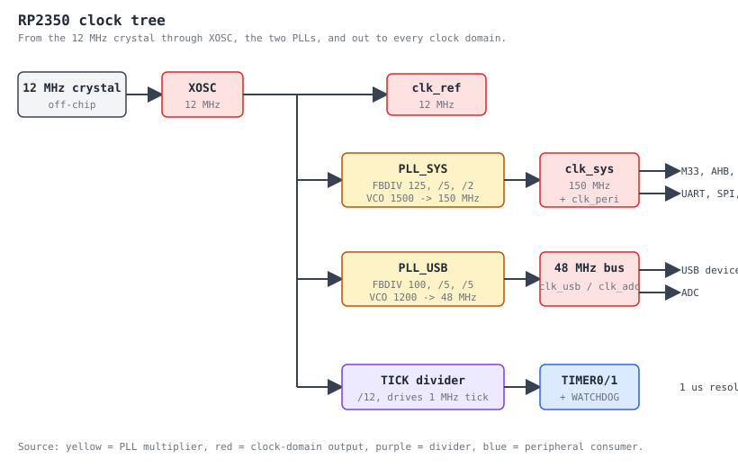

# clocks / reset / power

This document covers the RP2350 clock-tree configuration installed by
`src/main.S` (the production firmware) and `examples/clocks_demo.S` (a
standalone fixture).

## Final tree


## PLL math

For both PLLs:
```
  vco_freq = ref_freq * FBDIV / REFDIV
  out_freq = vco_freq / (POSTDIV1 * POSTDIV2)
```

Constraints (datasheet 8.6.3):
- `REFDIV in [1..63]`, but practical: 1
- `FBDIV in [16..320]`
- `POSTDIV1, POSTDIV2 in [1..7]`
- `vco_freq in [750 MHz..1600 MHz]`

### pll_sys -> 150 MHz
- ref = 12 MHz
- FBDIV = 125 -> VCO = 1500 MHz (in range)
- POSTDIV1 = 5, POSTDIV2 = 2 -> out = 1500 / 10 = 150 MHz

### pll_usb -> 48 MHz
- ref = 12 MHz
- FBDIV = 100 -> VCO = 1200 MHz (in range)
- POSTDIV1 = 5, POSTDIV2 = 5 -> out = 1200 / 25 = 48 MHz

## UART baud at clk_peri = 150 MHz

```
  divider     = 150e6 / (16 * 115200) = 81.380...
  IBRD        = floor(divider) = 81
  FBRD        = round((divider - IBRD) * 64) = round(24.32) = 24
  actual_baud = 150e6 / (16 * (81 + 24/64)) = 115211 Bd
  error       = -0.01 %  (well inside the 1 % spec)
```

The numbers live in `include/clocks.inc` as `UART_IBRD_150MHZ` /
`UART_FBRD_150MHZ`; `clocks_post_pll_uart_baud_fixup` writes them.

## Bring-up sequence (src/main.S)

```
  1. xosc_init                       -> XOSC stable @ 12 MHz
  2. pll_sys_150_mhz  ----+
  3. pll_usb_48_mhz   ----+--------> both PLLs locked
  4. clocks_init                     -> mux clk_ref=XOSC, clk_sys=PLL_SYS,
                                         clk_peri=clk_sys, clk_usb/adc=PLL_USB
  5. tick_init                       -> 1 MHz ticks for TIMER0/1/WATCHDOG
  6. watchdog_disable                -> safe state (no surprise resets)
  7. gpio_led_init                   -> LED on GP25
  8. uart0_init                      -> 12 MHz divisors (wrong, briefly)
  9. clocks_post_pll_uart_baud_fixup -> 150 MHz divisors (correct)
 10. uart0_puts(banner)
```

Total reset-to-banner cycle count (SO+T1 measurement, no PLL/XOSC stall):
~250 instructions, dominated by the busy-loop spin counters once the mocks
return STABLE/LOCK in zero time. On real silicon the XOSC startup adds
~1 ms and each PLL lock takes a few hundred microseconds.

## Why this order?

1. **XOSC before PLLs**: PLLs reference clk_ref derived from XOSC.
2. **Park clk_sys on clk_ref before retuning**: glitchless mux requires
   the source you're switching *away from* to be running. We park on
   ref so we can fiddle with the AUX (PLL) input safely (sec 8.1.4).
3. **Set AUXSRC before SRC=AUX**: switching SRC into a junk AUX
   gives you a dead clock. Always prime AUXSRC first.
4. **Disable clk_peri while reprogramming**: clk_peri has no glitchless
   mux; you must turn it off first.
5. **UART baud fixup AFTER clocks_init**: `uart0_init` writes baud
   divisors valid for 12 MHz. As soon as clk_peri jumps to 150 MHz the
   actual baud goes wrong by a factor of 12.5x. The fixup overwrites
   IBRD/FBRD with the new divisors and re-touches LCR_H to commit the
   baud latch.
6. **Watchdog disable explicit**: bootrom may have left it armed.
   Turning it off prevents a surprise reset during slow first-time
   bring-up.

## What this milestone does NOT do

- POWMAN VREG bump: the silicon default ~1.10 V is fine for 150 MHz;
  only required for >= 200 MHz.
- POWMAN unlock for VREG / RTC: we provide `powman_unlock_write` but
  don't call it.
- Per-core SysTick TICKS (PROC0/PROC1/RISCV ticks): deferred to M3.
- Frequency counter calibration / GPOUT clock observation: not needed
  for the M2 use case.
