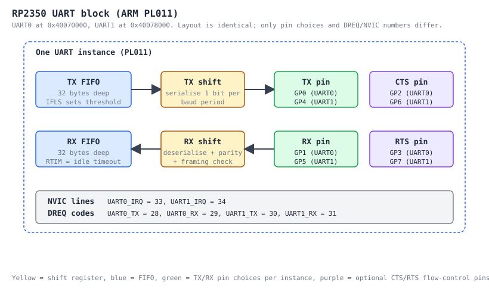

# M4-E - UART (PL011)

This document covers the RP2350 UART driver in `src/uart.S` and the three
end-to-end demos in `examples/uart_*.S`.

Datasheet reference: RP2350 datasheet rev 0.3 (Aug 2024) section 12.1.
Programmer's reference: ARM PrimeCell UART (PL011) Tech Ref. Manual r1p5
(DDI 0183G).  The RP2350 implementation matches that revision verbatim
plus the TX/RX DMA pacing extension exposed via the DMACR register.

## Block at a glance



## Register cookbook

| Off  | Reg     | Notes                                                          |
|------|---------|----------------------------------------------------------------|
| 0x00 | DR      | Data.  Write low 8 bits to TX; read low 8 bits from RX.        |
| 0x04 | RSR     | RX status / clear.  Mostly mirrored in DR upper bits.          |
| 0x18 | FR      | Flag.  TXFE/RXFE/TXFF/RXFF/BUSY/CTS.                           |
| 0x24 | IBRD    | Integer baud divisor.  16-bit.                                 |
| 0x28 | FBRD    | Fractional baud divisor.  6-bit.                               |
| 0x2C | LCR_H   | Line ctrl: WLEN, FEN, STP2, PEN/EPS, BRK, SPS.                 |
| 0x30 | CR      | Master ctrl: UARTEN, TXE, RXE, LBE, RTSEN, CTSEN, SIREN, ...   |
| 0x34 | IFLS    | TX/RX FIFO interrupt level (1/8, 1/4, 1/2, 3/4, 7/8).          |
| 0x38 | IMSC    | Interrupt mask set/clear.  RXIM, TXIM, RTIM, FEIM, ...         |
| 0x3C | RIS     | Raw interrupt status.                                          |
| 0x40 | MIS     | Masked (= RIS & IMSC) interrupt status.                        |
| 0x44 | ICR     | W1C interrupt clear.                                           |
| 0x48 | DMACR   | DMA control: TXDMAE, RXDMAE, DMAONERR.                         |

Atomic register aliases (+0x1000 XOR / +0x2000 SET / +0x3000 CLR) apply.

## Baud math

```
   divisor_q26 = clk_peri / (16 * baud)         (in Q26.6 fixed point: x64)
   IBRD        = floor(divisor_q26)
   FBRD        = round((divisor_q26 - IBRD) * 64)
   actual_baud = clk_peri / (16 * (IBRD + FBRD/64))
```

`uart_set_baudrate` and `uart_init` use the slightly simpler closed form
`(clk_peri * 4) / baud`, then split into IBRD = `>> 6` and FBRD = `& 0x3F`,
which truncates rather than rounds the FBRD bit.  The SDK and the datasheet
worked examples both truncate; the resulting baud error is < 0.1% at all
common rates we care about.

After writing IBRD/FBRD you MUST re-write LCR_H to commit the latch
(PL011 quirk; see TRM section 3.3.6).  All driver functions that touch
IBRD/FBRD do this for you.

### Pre-computed divisors (for reference)

| Clk     | Baud    | IBRD | FBRD | Actual    | Error    |
|---------|---------|------|------|-----------|----------|
| 12 MHz  | 115 200 | 6    | 33   | 115 108   | -0.08 %  |
| 12 MHz  | 230 400 | 3    | 16   | 230 769   | +0.16 %  |
| 12 MHz  | 460 800 | 1    | 40   | 462 692   | +0.41 %  |
| 150 MHz | 115 200 | 81   | 24   | 115 211   | +0.01 %  |
| 150 MHz | 230 400 | 40   | 44   | 230 415   | +0.01 %  |
| 150 MHz | 460 800 | 20   | 22   | 460 829   | +0.01 %  |
| 150 MHz | 921 600 | 10   | 11   | 921 658   | +0.01 %  |
| 150 MHz | 1 000 000 | 9  | 24   | 1 000 000 |  0.00 %  |

## Public API

All functions take `idx` (0 or 1) where applicable and follow AAPCS
(args in r0..r3; r4..r11 callee-saved).  Cycle counts measured on
Cortex-M33 from SRAM with no wait states.

| Function                                        | Cycles | Notes                                  |
|-------------------------------------------------|--------|----------------------------------------|
| `uart_init(idx, baud, clk)`                     | ~120   | RESETS + GPIO + IBRD/FBRD/LCR_H/CR     |
| `uart_deinit(idx)`                              | ~30    | CR=0; assert RESETS                    |
| `uart_set_baudrate(idx, baud, clk)`             | ~30    | UDIV-based; rewrites LCR_H to commit   |
| `uart_set_format(idx, bits, stop, parity)`      | ~20    | Preserves FEN                          |
| `uart_set_hw_flow(idx, cts, rts)`               | ~14    | Preserves CR.UARTEN/TXE/RXE            |
| `uart_set_irqs_enabled(idx, mask)`              | 4      | IMSC = mask                            |
| `uart_acknowledge_irq(idx, mask)`               | 4      | ICR = mask                             |
| `uart_set_dma_enabled(idx, tx, rx)`             | ~10    | DMACR = TXDMAE \| RXDMAE               |
| `uart_is_writable(idx) -> r0`                   | 4      | r0 = !(FR.TXFF)                        |
| `uart_is_readable(idx) -> r0`                   | 4      | r0 = !(FR.RXFE)                        |
| `uart_putc_blocking(idx, byte)`                 | ~6+poll| spin while TXFF; str DR                |
| `uart_puts_blocking(idx, str_ptr)`              | ~6/B+  | calls putc_blocking for each byte      |
| `uart_getc_blocking(idx) -> r0`                 | ~6+poll| spin while RXFE; ldr DR                |
| `uart_tx_wait_blocking(idx)`                    | poll   | spin while FR.BUSY                     |
| `uart_set_irq_handler(idx, handler)`            | ~14    | nvic_install_handler + nvic_enable_irq |

### v0.1 compatibility shims

`uart0_init`, `uart0_putc`, `uart0_puts` are preserved unchanged from v0.1.
`uart0_init` produces the EXACT same MMIO write sequence the v0.1 driver
did (PADS clears + IO_BANK0 funcsel + IBRD/FBRD/LCR_H/CR), so existing
trace tests (`tests/unicorn/test_v01_blinky.py`) continue to pass.

## IRQ programming model

PL011 interrupts are aggregated into a single NVIC line per instance:
UART0 -> IRQ 33, UART1 -> IRQ 34.  Inside the ISR the firmware reads MIS
to figure out which sources fired, services them, then writes those bits
to ICR.

Recommended pattern for an RX-driven echo handler:

```
uart0_isr:
    push    {r4, lr}
    @ Service every byte currently sitting in the RX FIFO
.Lloop:
    movs    r0, #0
    bl      uart_is_readable
    cbz     r0, .Lack
    movs    r0, #0
    bl      uart_getc_blocking
    @ ... do something with r0 ...
    b       .Lloop
.Lack:
    @ Clear both RXIM (FIFO threshold) and RTIM (timeout) so a single
    @ typed character doesn't stall waiting for the IFLS threshold.
    movs    r0, #0
    movw    r1, #(UART_INT_RXIM | UART_INT_RTIM)
    bl      uart_acknowledge_irq
    pop     {r4, pc}
```

Setup at boot:
```
    movs    r0, #0
    ldr     r1, =uart0_isr
    bl      uart_set_irq_handler            @ patches vector + nvic enable
    movs    r0, #0
    movw    r1, #(UART_INT_RXIM | UART_INT_RTIM)
    bl      uart_set_irqs_enabled
```

The driver does NOT touch IFLS so the trigger threshold stays at the
PL011 reset default of 1/2 (`UART_IFLS_LEVEL_1_2 << TXIFLSEL_LSB` and
similarly for RX).  Adjust by writing IFLS directly if you need finer
latency control.

## DMA pacing setup

Both TX and RX FIFOs can be drained / filled by the DMA controller.  The
PL011 raises `DREQ_UART<n>_TX` (codes 28, 30) when there is space in the
TX FIFO and `DREQ_UART<n>_RX` (codes 29, 31) when there is data in the
RX FIFO.  Wire one DMA channel per direction.

Minimal TX pacing example (extracted from `examples/uart_dma_demo.S`):

```
    movs    r0, #0
    movs    r1, #1                          @ tx
    movs    r2, #0                          @ rx
    bl      uart_set_dma_enabled            @ DMACR.TXDMAE = 1

    ldr     r1, =(DMA_CTRL_EN | DMA_DATA_SIZE_BYTE | DMA_CTRL_INCR_READ \
                | (DREQ_UART0_TX << DMA_CTRL_TREQ_SEL_LSB))
    ldr     r0, =RAMP_LEN
    movs    r4, #1
    push    {r0, r4}                        @ count, trig
    movs    r0, #0                          @ ch
    ldr     r2, =ramp                       @ src
    ldr     r3, =UART0_BASE + UART_DR       @ dst (fixed)
    bl      dma_channel_configure
```

For RX you mirror the configuration: src = `UART0_BASE + UART_DR` (fixed,
no INCR_READ), dst = SRAM buffer (INCR_WRITE), TREQ = `DREQ_UART0_RX`.

If you want the DMA channel to halt automatically on a UART RX error
(framing, parity, break, overrun) set `DMACR.DMAONERR = 1` in addition to
the RXDMAE bit; the PL011 then de-asserts RXDMAE on the next error and
the channel falls idle.

## RTS/CTS hardware flow control

`uart_set_hw_flow(idx, cts_en, rts_en)` toggles CR.RTSEN and CR.CTSEN
without disturbing UARTEN/TXE/RXE/SIREN.  You still need to route the
RTS/CTS pins to the UART function manually (the driver only configures
TX/RX during `uart_init`).  Per the RP2350 SDK convention:

| UART | TX  | RX  | CTS | RTS |
|------|-----|-----|-----|-----|
| 0    | GP0 | GP1 | GP2 | GP3 |
| 1    | GP4 | GP5 | GP6 | GP7 |

Example wiring snippet:

```
    @ TX/RX done by uart_init.  Now route CTS/RTS pads to the UART function.
    movs    r0, #2                          @ CTS pin
    movs    r1, #GPIO_FUNC_UART
    bl      gpio_set_function
    movs    r0, #3                          @ RTS pin
    movs    r1, #GPIO_FUNC_UART
    bl      gpio_set_function

    @ Enable both directions of HW flow.
    movs    r0, #0
    movs    r1, #1                          @ cts_en
    movs    r2, #1                          @ rts_en
    bl      uart_set_hw_flow
```

The PL011 implements RTS as "we have RX FIFO room above the IFLS RX trigger
level"; it auto-deasserts when the FIFO crosses 7/8 and re-asserts on a
read that drops it below the IFLS threshold.

## Examples

| File                                | What it does                                    |
|-------------------------------------|-------------------------------------------------|
| `examples/uart_irq_demo.S`          | UART0 RX IRQ echo + GP25 LED toggle per byte    |
| `examples/uart_dma_demo.S`          | DMA paced 256-byte ramp out of UART0 TX         |
| `examples/uart_loopback_demo.S`     | UART0 <-> UART1 ping/pong at 921 600 8N1        |

The loopback example expects the user to jumper TX0 -> RX1 and TX1 -> RX0
on a real board.  Under Renode (`tests/renode/uart.resc`) we wire it via
the standard `UARTHub` connector mechanism so no jumper is required.

## Testing

| Tier | Coverage                                                              |
|------|-----------------------------------------------------------------------|
| T1   | 29 unit tests in `tests/unicorn/test_uart.py` covering every public   |
|      | entry point + the v0.1 trace contract + all 3 example UF2 builds.     |
| T2   | N/A.  The PL011 model is generic enough to run on QEMU `mps2-an505`,  |
|      | but the RP2350-specific base addresses won't match any QEMU machine.  |
| T3   | `tests/renode/uart.resc` runs `uart_loopback_demo` for 500 ms and     |
|      | asserts both UARTs see their respective bytes.                        |
